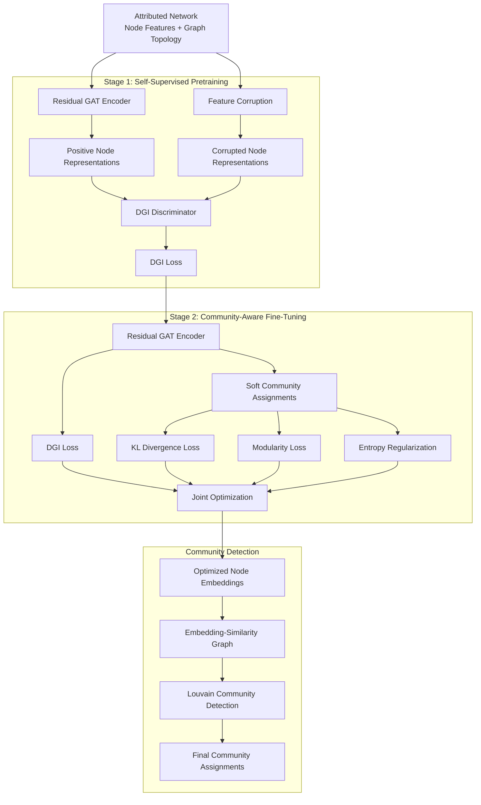

<div align="center">
  
</div>

---

# Self-Supervised Graph Representation Learning with Community-Aware Optimization for Attributed Networks Community Detection

Official implementation of the **RAGE-CD** (Residual Attention Graph Embedding for Community Detection) method, introduced in the research paper **“Self-Supervised Graph Representation Learning with Community-Aware Optimization for Attributed Networks Community Detection.”**

This repository implements a two-stage self-supervised framework for community detection in attributed networks, combining a **Residual Graph Attention Network (Residual GAT)** encoder with **Deep Graph Infomax (DGI)** pretraining and community-aware fine-tuning through modularity optimization, KL-based cluster refinement, entropy regularization, and the DGI objective.

<div align="left">

[](https://www.python.org/)
[](https://pytorch.org/)
[](https://pyg.org/)
[](https://networkx.org/)
[](https://python-louvain.readthedocs.io/)
[](https://scikit-learn.org/)
[](#)
[](#)

</div>

## Abstract

Community detection in attributed networks requires simultaneously exploiting graph topology and node attributes to uncover meaningful community structures. This repository provides a self-supervised graph representation learning framework that integrates representation learning with community-aware optimization.

The proposed framework follows a two-stage learning strategy. In the first stage, a **Residual Graph Attention Network (Residual GAT)** encoder is pretrained using **Deep Graph Infomax (DGI)** to learn informative node representations without relying on community labels. In the second stage, the pretrained encoder is fine-tuned using a joint objective that incorporates the **DGI loss**, a **KL-divergence-based cluster refinement objective**, a **differentiable modularity loss**, and an **entropy regularization term**.

The resulting node representations are subsequently transformed into an embedding-similarity graph, followed by **Louvain community detection**. Community quality is evaluated using both structural metrics and, where ground-truth labels are available, external clustering metrics.

## Table of Contents

1. [Overview](#overview)
2. [Methodology](#methodology)
3. [System Architecture](#system-architecture)
4. [Training Pipeline](#training-pipeline)
5. [Community Detection and Evaluation](#community-detection-and-evaluation)
6. [Tools and Technologies](#tools-and-technologies)
7. [Project Structure](#project-structure)
8. [Installation](#installation)
9. [Running the Experiments](#running-the-experiments)
10. [Citation](#citation)
11. [Author](#author)

# Overview

The framework is designed for **unsupervised community detection in attributed networks**, where both node attributes and graph topology contribute to the identification of community structure.

The overall methodology integrates self-supervised graph representation learning with community-aware optimization rather than treating representation learning and community detection as fully independent stages.

Core components include:

* Residual Graph Attention-based representation learning
* Deep Graph Infomax pretraining
* Community-aware unsupervised fine-tuning
* Joint DGI, KL, modularity, and entropy objectives
* Embedding-based similarity graph construction
* Louvain community detection
* Structural and external community evaluation

# Methodology

The proposed framework combines self-supervised representation learning with a community-aware optimization strategy.

## Residual Graph Attention Encoder

The graph encoder is constructed from stacked residual graph-attention blocks.

Each block integrates:

* Multi-head graph attention through `GATConv`
* A learnable residual projection
* Batch normalization
* ReLU activation

The residual design enables the model to propagate information across multiple graph-attention layers while preserving the original feature signal.

The encoder produces compact node representations that capture information from both graph connectivity and node attributes.

## Self-Supervised DGI Pretraining

The first stage performs self-supervised representation learning using **Deep Graph Infomax (DGI)**.

A corrupted version of the node attributes is generated by randomly permuting node features while preserving the graph topology. Positive and corrupted node representations are then distinguished through a bilinear discriminator.

This pretraining stage encourages the encoder to learn node representations that capture meaningful global and local graph information without requiring ground-truth community labels.

## Community-Aware Fine-Tuning

Following DGI pretraining, the encoder is fine-tuned using a joint community-aware objective.

The fine-tuning stage explicitly considers all four optimization components:

### (Optional) DGI Objective

The DGI objective remains part of the joint optimization process, allowing the model to preserve the informative self-supervised representations learned during pretraining while adapting them to the community detection task.

### KL-Based Cluster Refinement

A DEC-style target distribution is generated from the soft community assignments. KL divergence is then used to progressively refine the predicted assignments toward more discriminative community structures.

### Differentiable Modularity Optimization

A differentiable modularity objective is incorporated directly into model optimization. Maximizing this objective encourages the learned community assignments to produce stronger structural separation and denser intra-community connectivity.

### Entropy Regularization

Entropy regularization is used to discourage degenerate assignment patterns and promote meaningful community membership distributions.

### Joint Fine-Tuning Objective

The complete fine-tuning objective is therefore composed of:

* DGI loss
* KL divergence loss
* Modularity loss
* Entropy regularization

The corresponding loss weights are controlled through the experiment configuration implemented in the source code.

# System Architecture

The implementation follows a two-stage self-supervised architecture in which graph representation learning is followed by community-aware optimization and graph-based community detection.

## Architectural Components

| Component                     | Role                                                       |
| :----------------------------- | :---------------------------------------------------------- |
| Residual GAT Encoder          | Learns topology- and attribute-aware node representations  |
| DGI Pretraining               | Learns self-supervised graph representations               |
| DGI Discriminator             | Distinguishes positive and corrupted node representations  |
| Soft Cluster Assignment       | Produces differentiable community membership probabilities |
| KL Objective                  | Refines and sharpens community assignments                 |
| Modularity Loss               | Directly optimizes structural community quality            |
| Entropy Regularizer           | Reduces degenerate community assignments                   |
| Joint Fine-Tuning Objective   | Integrates DGI, KL, modularity, and entropy objectives     |
| Similarity Graph Construction | Builds an embedding-based weighted graph                   |
| Louvain                       | Performs final community detection                         |
| Evaluation Module             | Computes structural and external community metrics         |

# Training Pipeline

The training procedure consists of two consecutive optimization stages followed by graph-based community detection.



The first stage initializes the encoder through DGI-based self-supervised learning. The pretrained encoder is then used as the starting point for the second stage.

During fine-tuning, the encoder is jointly optimized using the **DGI loss, KL divergence, modularity loss, and entropy regularization**. This enables the learned representation to retain informative graph-level characteristics while becoming increasingly aligned with community structure.

The optimized node embeddings are then used to construct an embedding-similarity graph, which serves as the input to the final Louvain community detection stage.

# Community Detection and Evaluation

After fine-tuning, the learned node embeddings are normalized and used to construct a weighted similarity graph over the observed graph edges.

For each graph edge, the corresponding embedding similarity is used as the edge weight. This produces a graph in which learned representation similarity complements the original network topology.

The resulting graph is passed to **Louvain community detection** to obtain the final community assignments.

## Structural Metrics

The implementation evaluates the structural quality of the detected communities using:

* **Modularity**
* **Coverage**
* **Conductance**

These metrics evaluate how strongly the detected communities correspond to the connectivity structure of the underlying network.

## External Metrics

When ground-truth labels are available, the implementation additionally reports:

* **Normalized Mutual Information (NMI)**
* **Adjusted Rand Index (ARI)**
* **Macro F1**
* **Macro Precision**
* **Macro Recall**
* **Accuracy**

External metrics are computed by aligning detected communities with the available ground-truth labels.

# Tools and Technologies

| Technology        | Purpose                                       |
| :----------------- | :--------------------------------------------- |
| PyTorch           | Deep learning implementation and optimization |
| PyTorch Geometric | Graph neural network operations               |
| GATConv           | Multi-head graph attention                    |
| NetworkX          | Graph construction and structural analysis    |
| python-louvain    | Louvain community detection                   |
| NumPy             | Numerical computation                         |
| Pandas            | Experimental result processing                |
| Scikit-learn      | External evaluation metrics                   |

# Project Structure

```text
Self-Supervised-Community-Aware-Graph-Representation-Learning-for-Attributed-Networks
│
├── README.md
├── requirements.txt
├── run_experiment.py
│
├── src/
│   ├── __init__.py
│   ├── config.py
│   ├── data.py
│   ├── evaluate.py
│   ├── losses.py
│   ├── models.py
│   ├── train.py
│   └── utils.py
│
└── notebooks/
    └── demo.ipynb
```

### Core Modules

| File                   | Description                                                               |
| :---------------------- | :------------------------------------------------------------------------- |
| `src/models.py`        | Residual GAT encoder and DGI discriminator                                |
| `src/losses.py`        | DGI, modularity, KL-based refinement, and entropy-related loss components |
| `src/train.py`         | DGI pretraining and community-aware fine-tuning                           |
| `src/evaluate.py`      | Similarity graph construction and community evaluation                    |
| `src/data.py`          | Dataset loading and graph preparation                                     |
| `src/config.py`        | Model and experiment hyperparameters                                      |
| `src/utils.py`         | Shared graph and training utilities                                       |
| `run_experiment.py`    | End-to-end experimental driver                                            |
| `notebooks/demo.ipynb` | Notebook interface for experimentation                                    |

# Installation

## Clone Repository

```bash
git clone https://github.com/ParmidaGh/Self-Supervised-Community-Aware-Graph-Representation-Learning-for-Attributed-Networks.git

cd Self-Supervised-Community-Aware-Graph-Representation-Learning-for-Attributed-Networks
```

## Install Dependencies

```bash
pip install -r requirements.txt
```

A compatible PyTorch and PyTorch Geometric installation is required. For GPU execution, install the appropriate PyTorch build for the target CUDA environment.

# Running the Experiments

Run the complete experimental pipeline with:

```bash
python run_experiment.py
```

The script performs the complete workflow:

1. Loads the graph data and node attributes.
2. Initializes the Residual GAT encoder.
3. Performs DGI-based self-supervised pretraining.
4. Fine-tunes the encoder using the joint DGI, KL, modularity, and entropy objective.
5. Generates optimized node embeddings.
6. Constructs the embedding-similarity graph.
7. Applies Louvain community detection.
8. Computes structural and external evaluation metrics.
9. Repeats the experiment for the configured number of independent runs.
10. Reports the resulting experimental metrics.

The notebook implementation can also be explored through:

```text
notebooks/demo.ipynb
```

# Citation

If you use this implementation in academic work, please cite the corresponding paper:

```bibtex
@article{ghamari_self_supervised_graph_representation,
  title   = {Self-Supervised Graph Representation Learning with Community-Aware Optimization for Attributed Networks Community Detection},
  author  = {Ghamari, Parmida and Asadpour, Masoud and Rezvanian, Alireza},
  year    = {2026},
  note    = {Research implementation}
}
```

# Author

**Parmida Ghamari**
M.Sc. in Information Technology, University of Tehran
Research Assistant @ Social Networks Lab

**Research Interests:** Graph Representation Learning, Graph Neural Networks, Community Detection, Network Science, Self-Supervised Learning, Attributed Networks, Deep Learning

📧 [Parmida.ghamari@gmail.com](mailto:Parmida.ghamari@gmail.com)
💻 [github.com/ParmidaGh](https://github.com/ParmidaGh)
💼 [linkedin.com/in/parmida-ghamari](https://www.linkedin.com/in/parmida-ghamari)
